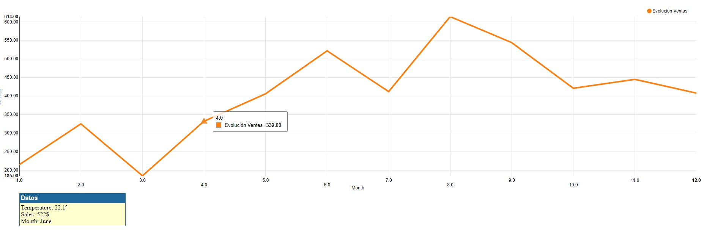
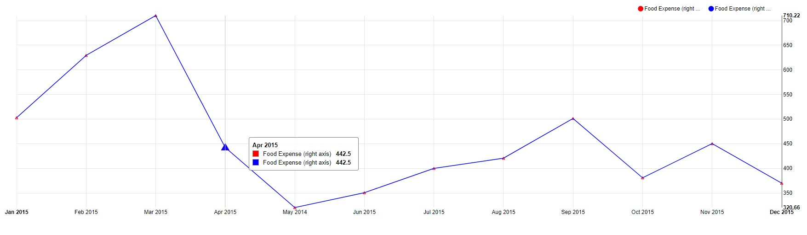
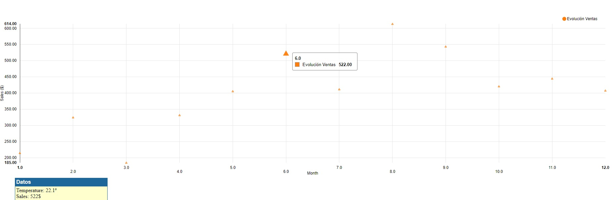

# Nvd3 library: Create a Line chart

The target of this script is to Create a Line chart adding dots and interaction (whenever you click on the dots display information), but using **Nvd3 library**.

For this exercise we will use 3 diferents model options inside Nvd3 library

- lineChart
- multiChart
- scatterChart

**Summary of results**

- Chart using **linechart**:

- Chart using **multiChart**:

- Chart using **scatterChart**:

